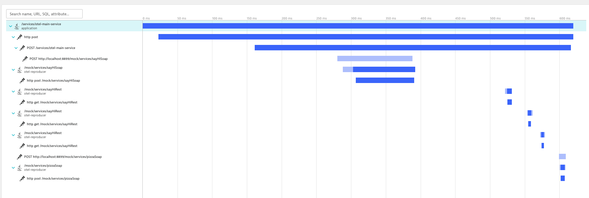
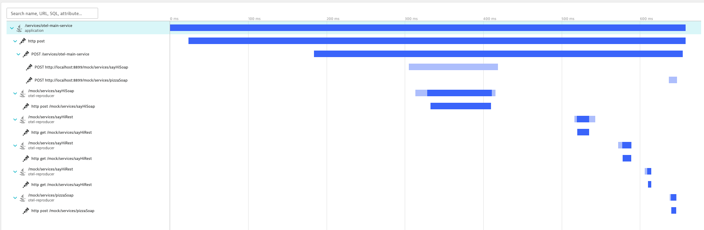

# Camel CXF OpenTelemetry reproducer

## OpenTelemetry agent

Please download the OpenTelemetry agent from https://github.com/open-telemetry/opentelemetry-java-instrumentation/releases/download/v2.8.0/opentelemetry-javaagent.jar and save it as `etc/opentelemetry-javaagent-2.8.0.jar`.

## Running

- Start the `reproducer` project
- If you're using IntelliJ IDEA, there's a sample request file available at `reproducer/src/test/resources/test-requests.http`.

### Traces without fixes

- CXF async mode: []
- CXF sync mode: []
